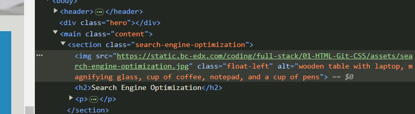

# Code Accessibility Refactor

  

## Technology Used

  

| Technology Used | Resource URL |

| ------------- |:-------------:|

| HTML | [https://developer.mozilla.org/en-US/docs/Web/HTML](https://developer.mozilla.org/en-US/docs/Web/HTML) |
[https://www.w3schools.com/html/default.asp](https://www.w3schools.com/html/default.asp) |

| CSS | [https://developer.mozilla.org/en-US/docs/Web/CSS](https://developer.mozilla.org/en-US/docs/Web/CSS) |

| Git | [https://git-scm.com/](https://github.com/keithamadeus/Module-1-Challenge) |

  

## Code Refactor Using agile project management to increase Accessibility

  

[Visit the Deployed Site](https://keithamadeus.github.io/Module-1-Challenge/)

  
With 7 concise commits detailing the aspects of the changes in the refactor I created a more accessible to ensure people with disabilities can access a website using assistive technologies such as video captions, screen readers, and braille keyboards. Is it good for business by being better positioned in search engines.


While challenging to update the HTML elements in the correct format, before diving into the CSS, it was important to also update all of the < div > elements to ensure they were updated to industry standards. Ensured accessibility by adding alt="example content" elements in ability to be used by assistive technology. Finally, I sifted through the CSS to make sure all of the new variables had the correct selectors, and cleaned up the code into a more readable fashion. 
  
In this refactor project, I had the privilege to understand why accessibility standards are implemented and required to help everyone from all walks of life reach the same information as people without disabilities. It is important to write code with intent to help everyone find information. 


  
## Code Refactor Example

  
Prior, HTML did not have sematic elements, alt attributes on images, and there was not title.


  
  

```html

<div class="hero"></div>

<div class="content">

<div class="search-engine-optimization">


<h2>Search Engine Optimization</h2>

<p>

The dominance of mobile internet use means that users are searching for the right business as they travel, shop, or sit on their couch at home. Search Engine Optimization (SEO) allows you to increase your visibility and find the right customers for your business.

</p>

</div>

<div id="online-reputation-management" class="online-reputation-management">


<h2>Online Reputation Management</h2>

<p>

The web is full of opinions, and some of these can be negative. Social media allows anyone with an internet connection to say whatever they want about your business. Online Reputation Management gives you the control over what potential customers see when they search for your business.

</p>

</div>

<div id="social-media-marketing" class="social-media-marketing">


```

  


Converted the above and added sematic elements, alt attributes on images, and updated Title

  

```html

<div  class="hero"></div>

<main  class="content">

<section  class="search-engine-optimization">


<h2>Search Engine Optimization</h2>

<p>

The dominance of mobile internet use means that users are searching for the right business as they travel,

shop, or sit on their couch at home. Search Engine Optimization (SEO) allows you to increase your visibility

and find the right customers for your business.

</p>

</section>

<section  id="online-reputation-management"  class="online-reputation-management">


<h2>Online Reputation Management</h2>

<p>

The web is full of opinions, and some of these can be negative. Social media allows anyone with an internet

connection to say whatever they want about your business. Online Reputation Management gives you the control

over what potential customers see when they search for your business.

</p>

</section>

<section  id="social-media-marketing"  class="social-media-marketing">  

```

  
After HTML changes, the selectors were all incorrect:
  

```css

.header {

padding: 20px;

font-family: 'Trebuchet MS', 'Lucida Sans Unicode', 'Lucida Grande', 'Lucida Sans', Arial, sans-serif;

background-color: #2a607c;

color: #ffffff;

}

  

.header h1 {

display: inline-block;

font-size: 48px;

}

  

.header h1 .seo {

color: #d9dcd6;

}

  

.header div {

padding-top: 15px;

margin-right: 20px;

float: right;

font-family: 'Gill Sans', 'Gill Sans MT', Calibri, 'Trebuchet MS', sans-serif;

font-size: 20px;

}

  

.header div ul {

list-style-type: none;

}

  

.header div ul li {

display: inline-block;

margin-left: 25px;

}

```

Updated Selectors to make style sheet work correctly with the new changes. 
 

```css

header {

padding:  20px;

font-family:  'Trebuchet MS', 'Lucida Sans Unicode', 'Lucida Grande', 'Lucida Sans', Arial, sans-serif;

background-color:  #2a607c;

color:  #ffffff;

}

  

header h1 {

display:  inline-block;

font-size:  48px;

}

  

header h1 .seo {

color:  #d9dcd6;

}

  

header nav{

padding-top:  15px;

margin-right:  20px;

float:  right;

font-family:  'Gill Sans', 'Gill Sans MT', Calibri, 'Trebuchet MS', sans-serif;

font-size:  20px;

}

  

header nav ul {

list-style-type:  none;

}

  

header nav ul li {

display:  inline-block;

margin-left:  25px;

}

```

  

## Usage

 
Main usage will be experienced by people using accessibility assistive technology. They will have a clearer understanding of the pictures and their descriptions on the page now. 

  





  
  

## Learning Points

  
 Had the privilege of refactoring a site to make it more accessible to users with disabilities. 
This project provided the perspective it takes to help all people be able to connect with information. 
  
  

## Author Info

  

```md

### Keith A. Williams

  
  
* [LinkedIn](https://www.linkedin.com/in/keith-williams-7841b022/)

* [Github](https://github.com/keithamadeus)

```
